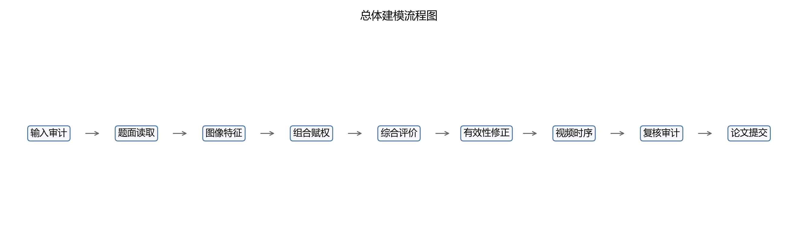
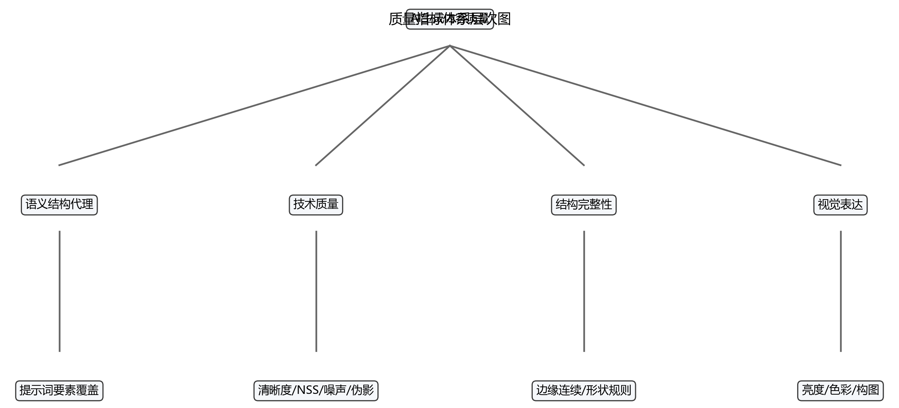
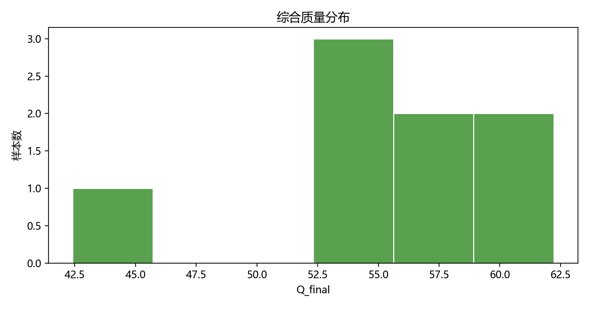
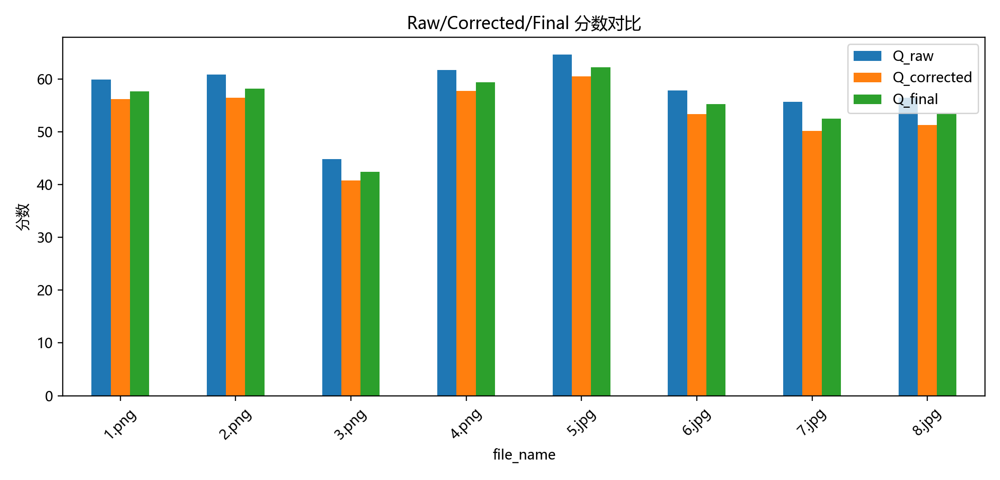
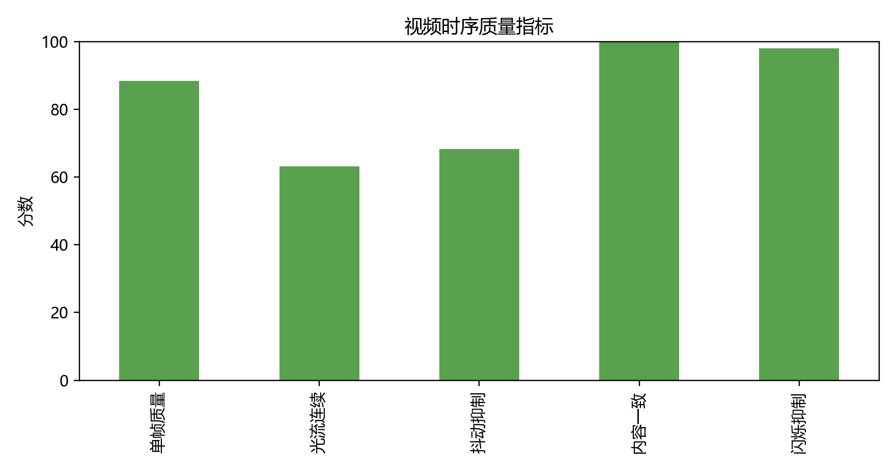
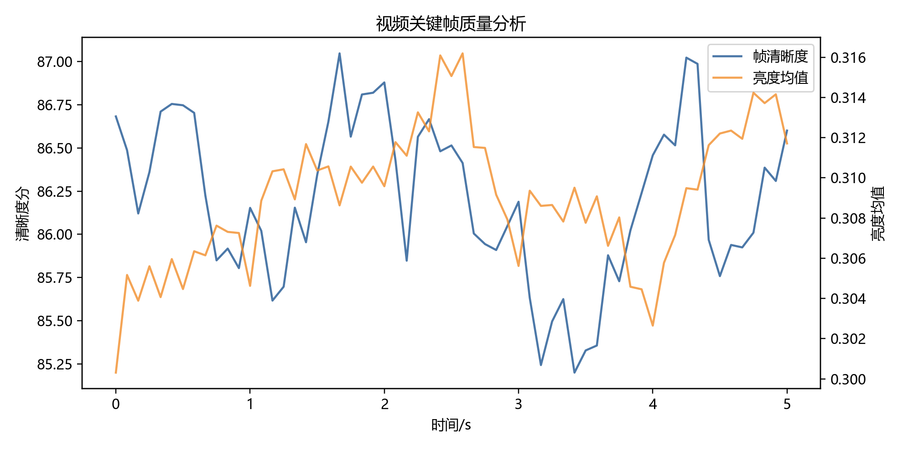
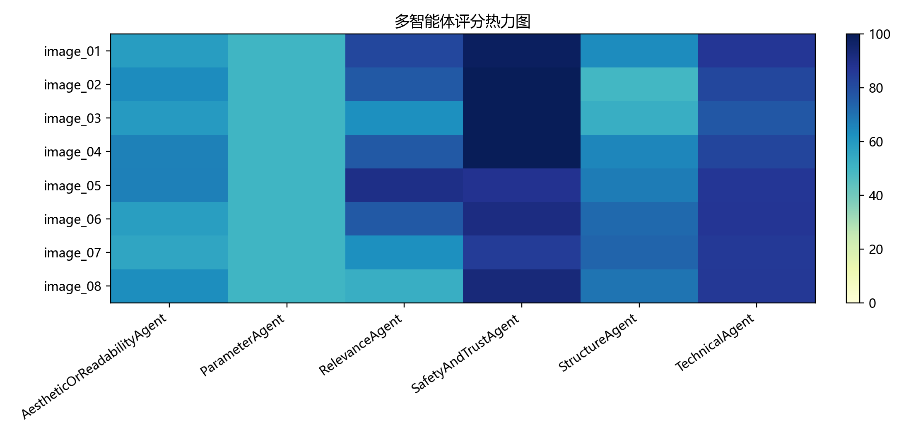

# 基于组合赋权与时序一致性的 AI 生成内容质量评估模型

## 摘要

针对 2026 年第八届中青杯数学建模竞赛 B 题，本文围绕 AI 生成图像和视频的质量评价建立无参考评价模型。首先将图像质量分解为语义结构完整性代理、技术质量、结构完整性和视觉表达四类指标，构造 Laplacian 清晰度、自然场景统计质量、伪影风险、边缘连续性、形状规则性、亮度均衡、色彩丰富度和构图代理等可计算指标。其次采用 AHP、熵权法和 CRITIC 法组合赋权，并利用 TOPSIS 与灰色关联分析得到图像综合质量分。为避免分辨率、边缘复杂度等数量指标造成虚高，进一步引入有效性门控和风险惩罚，得到最终质量指数。最后针对附件 2 的车流视频，建立基于 Farneback 光流连续性、颜色直方图一致性和亮度突变的时序质量模型。

附件 1 的 8 张图像中，综合质量最高样本为 5.jpg，最终分为 62.23；最低样本为 3.png，最终分为 42.41。为回应题面高/中/低质量覆盖要求，本文同时给出固定阈值绝对等级和附件内部相对三档等级；相对等级只表示本批 8 张图像内部排序，不解释为专家标签。附件 2 视频时序质量分为 81.37，模型判断时序失稳标记为 否。由于附件未提供原始提示词、专家评分和真实生成参数，参数优化部分仅给出不适用审计和可观测代理敏感性分析。

**关键词**：AI 生成内容；无参考图像质量评价；组合赋权；TOPSIS；灰色关联；光流连续性

## 1 问题重述

B 题要求建立 AI 生成内容质量评价模型。问题一要求建立无参考图像质量评价数学模型，题面强调提示词语义保真度、技术质量和结构完整性等指标；问题二要求对附件 1 的 8 张 AI 生成图像进行评估，并分析内容类型对指标敏感性的影响；问题三要求建立视频时序质量模型，考虑光流连续性、内容一致性、闪烁检测以及时序失稳条件，并分析附件 2 的车流视频。

## 2 问题分析

AI 生成图像没有标准参考图像，不能直接使用 PSNR 或 SSIM。因此应采用无参考评价思路，把画面质量拆解为可解释的统计和结构指标。对于视频，单帧图像质量不足以判断整体质量，还需要衡量相邻帧运动场是否平滑、颜色和亮度是否突变、场景内容是否保持一致。

## 3 模型假设

1. 附件未给出原始提示词，本文不计算真实 prompt-image 保真度，只计算语义结构完整性代理。
2. 附件未给出专家标签，本文分级为模型综合等级。
3. 附件未给出真实生成参数，因此不做真实参数优化。
4. 视频不使用外部训练检测器，车辆和场景稳定性使用光流与视觉统计代理。

## 4 符号说明

| 符号 | 含义 |
|---|---|
| $X=(x_{ij})$ | 原始指标矩阵 |
| $x'_{ij}$ | 归一化指标 |
| $w_j$ | 第 $j$ 个指标组合权重 |
| $C_i$ | TOPSIS 贴近度 |
| $G_i$ | 灰色关联度 |
| $Q_i$ | 综合质量分 |
| $G_{valid}$ | 有效性门控 |
| $F_t$ | 第 $t$ 对帧的光流场 |

## 5 数据预处理与特征提取

附件 1 包含 8 张图像，附件 2 包含 1 个 24 fps、121 帧的车流视频。图像使用 Pillow 和 OpenCV 读取，统一在缩放副本上计算特征；视频按固定间隔采样帧并计算相邻帧光流。

题面问题二提到样本需覆盖写实风景、人物肖像、艺术插画、产品渲染等类型，但附件 1 的 8 张图经可视审计未发现明确产品渲染样本。为保证数据真实性，本文按附件实际内容类型建立样本清单和敏感性分析，不补造不存在的产品渲染样本或质量标签。

| 样本ID | 文件 | 类型 | 最终分 | 绝对等级 | 相对等级 |
|---|---|---|---:|---|---|
| image_05 | 5.jpg | 写实风景 | 62.23 | 中等 | 相对高 |
| image_04 | 4.png | 动态街景 | 59.34 | 中等 | 相对高 |
| image_02 | 2.png | 人物肖像 | 58.20 | 中等 | 相对中 |
| image_01 | 1.png | 写实风景 | 57.68 | 中等 | 相对中 |
| image_06 | 6.jpg | 人物插画 | 55.22 | 中等 | 相对中 |
| image_08 | 8.jpg | 像素街景 | 53.41 | 较低 | 相对低 |
| image_07 | 7.jpg | 水墨插画 | 52.50 | 较低 | 相对低 |
| image_03 | 3.png | 艺术插画 | 42.41 | 较低 | 相对低 |

## 6 问题一：无参考图像质量评价模型

### 6.1 指标体系

设图像样本数为 $n$，指标数为 $m$，原始矩阵为

$$
X=(x_{ij})_{n\times m}.
$$

正向指标采用极差归一化

$$
x'_{ij}=\frac{x_{ij}-\min_i x_{ij}}{\max_i x_{ij}-\min_i x_{ij}},
$$

负向指标采用

$$
x'_{ij}=\frac{\max_i x_{ij}-x_{ij}}{\max_i x_{ij}-\min_i x_{ij}}.
$$

对复杂度、数量和边缘规模类指标采用饱和函数

$$
q(x)=1-\exp(-x/\tau),
$$

防止“越多越好”的评分虚高。

### 6.2 语义结构完整性代理

题面要求将提示词分为主体对象、属性描述、场景关系、风格指令四类。由于附件没有原始提示词，本文不能计算真实 prompt-image 语义保真度，而是用审题可视描述构造代理文本 $T_i$，建立语义结构完整性代理指标。设四类要素集合分别为 $E_i^s,E_i^a,E_i^r,E_i^g$，语义要素覆盖分为

$$
S_i=0.55\frac{I(E_i^s)+I(E_i^a)+I(E_i^r)+I(E_i^g)}{4}+0.45\min\left(\frac{|T_i|}{9},1\right).
$$

该指标只表示代理描述是否覆盖题面要求的语义维度，不代表原始提示词匹配度，也不等同于 CLIP 语义相似度。

### 6.3 技术质量与结构完整性

清晰度采用 Laplacian 方差：

$$
L_i=Var(\nabla^2 I_i),\quad S^L_i=\frac{\log(1+L_i)}{\log(1+L_0)}.
$$

伪影风险综合像素截断率、块效应和过平滑风险：

$$
R_i^A=0.45R_i^c+0.35R_i^b+0.20R_i^o.
$$

边缘连续性基于 Canny 边缘连通区域的高分位面积 $A_{90}$：

$$
E_i=(1-e^{-A_{90}/\tau_A})(1-e^{-d_i/\tau_d}).
$$

结构完整性为

$$
H_i=0.55E_i+0.30R_i^s+0.15(1-R_i^A).
$$

## 7 问题二：图像综合评价算法与结果

### 7.1 组合赋权

AHP 权重由评价逻辑构造一致判断矩阵；熵权法刻画样本区分度；CRITIC 法刻画指标波动和冲突性。组合权重为

$$
w=\alpha w^{AHP}+\beta w^{Entropy}+\gamma w^{CRITIC},\quad \alpha+\beta+\gamma=1.
$$

### 7.2 TOPSIS-灰色关联综合评价

TOPSIS 贴近度为

$$
C_i=\frac{D_i^-}{D_i^+ + D_i^-}.
$$

灰色关联系数为

$$
\xi_{ij}=\frac{\Delta_{min}+\rho\Delta_{max}}{\Delta_{ij}+\rho\Delta_{max}},
$$

关联度为 $G_i=\sum_j w_j\xi_{ij}$。综合分采用

$$
Q_i=100[0.5C_i+0.5G_i].
$$

### 7.3 有效性修正

为避免高分辨率、强边缘或复杂纹理导致虚高，设有效性门控

$$
G_{valid}=0.30V_r+0.25V_t+0.20V_s+0.15V_m+0.10V_e.
$$

最终分为

$$
Q_{final}=clip(Q_{raw}(0.85+0.15G_{valid})-0.5P,0,100).
$$

### 7.4 绝对等级与相对等级

固定阈值绝对等级反映模型分数是否达到预设质量区间；附件内部相对等级用于回应题面“高、中、低质量等级”的比较需求。本文按 `Q_final` 排序，将第 1-2 名定义为相对高，第 3-5 名定义为相对中，第 6-8 名定义为相对低。该相对等级只用于本批附件内部比较，不是专家标签。

| 样本ID | 文件 | 类型 | 最终分 | 绝对等级 | 相对等级 | 关键优势 | 关键弱点 |
|---|---|---|---:|---|---|---|---|
| image_05 | 5.jpg | 写实风景 | 62.23 | 中等 | 相对高 | 伪影抑制 | 视觉表达 |
| image_04 | 4.png | 动态街景 | 59.34 | 中等 | 相对高 | 伪影抑制 | 结构完整性 |
| image_02 | 2.png | 人物肖像 | 58.20 | 中等 | 相对中 | 伪影抑制 | 结构完整性 |
| image_01 | 1.png | 写实风景 | 57.68 | 中等 | 相对中 | 伪影抑制 | 视觉表达 |
| image_06 | 6.jpg | 人物插画 | 55.22 | 中等 | 相对中 | 伪影抑制 | 视觉表达 |
| image_08 | 8.jpg | 像素街景 | 53.41 | 较低 | 相对低 | 伪影抑制 | 语义结构完整性代理 |
| image_07 | 7.jpg | 水墨插画 | 52.50 | 较低 | 相对低 | 伪影抑制 | 视觉表达 |
| image_03 | 3.png | 艺术插画 | 42.41 | 较低 | 相对低 | 伪影抑制 | 结构完整性 |

### 7.5 内容类型敏感性

写实风景类更依赖清晰度、自然场景统计和亮度均衡；人物肖像和人物插画更依赖结构完整性、边缘连续性和伪影风险；水墨、像素等强风格图像的自然场景统计得分未必最高，因此需要把风格与技术质量分开解释。

由于附件实际样本未覆盖明确产品渲染图，本文不对产品渲染类型给出单独敏感性结论；若后续补充产品样本，可复用同一指标体系并重点比较边缘规则性、材质高光、透视一致性和伪影风险。

## 8 问题三：视频时序质量评价模型

### 8.1 光流连续性

设 $F_t(x,y)=(u_t,v_t)$ 为相邻帧光流。光流空间平滑性定义为

$$
S_t^f=\frac{1}{1+\frac{\|\nabla |F_t|\|_1}{\overline{|F_t|}+\epsilon}}.
$$

光流时间抖动为

$$
J=median_t\left(\frac{\| |F_t|-|F_{t-1}|\|_1}{\overline{|F_t|}+\epsilon}\right),
$$

抖动抑制分为 $S^j=1/(1+J)$。

### 8.2 内容一致性与闪烁检测

内容一致性使用 HSV 二维直方图相关系数 $H_t$；亮度闪烁用相邻帧均值亮度差

$$
B_t=|\bar{Y}_t-\bar{Y}_{t-1}|.
$$

闪烁抑制分为

$$
S^b=clip(1-\overline{B_t}/0.08,0,1).
$$

视频时序质量分为

$$
Q_v=100(0.25S^I+0.25S^f+0.20S^j+0.20S^H+0.10S^b).
$$

### 8.3 时序失稳必要条件

若同时出现较大的亮度突变、较低的光流平滑性、较低内容一致性或整体时序分低于阈值，则可判定存在时序失稳风险。本文使用以下必要条件：

$$
\overline{B_t}>0.08\quad \text{or}\quad \overline{S_t^f}<0.45\quad \text{or}\quad \overline{H_t}<0.70\quad \text{or}\quad Q_v<65.
$$

附件 2 视频的时序质量分为 81.37，时序失稳标记为 否。

## 9 可靠性与稳定性分析

本文使用 TOPSIS、灰色关联和加权和进行跨模型对比，并对 $\lambda=0.3,0.5,0.7$ 做敏感性分析。多智能体复核仅作为规则型复核，不覆盖主评分。

## 10 模型评价

优点：模型完全本地可复现，指标均有明确数学定义；评分过程兼顾主观评价逻辑和客观数据差异；视频模型直接对应题面给出的光流、内容一致性和闪烁因素。

不足：缺少原始提示词、专家评分和真实生成参数，语义结构完整性和等级校准只能使用代理；附件 1 仅含 8 张图像，组合赋权和相对分级主要用于本批样本内部比较，外推到更大规模 AIGC 图像集时需要重新校准权重和等级阈值；没有训练式目标检测器时，车流视频中的车辆数量和身份一致性只能由光流与颜色统计间接描述。

## 11 结论

本文建立了覆盖图像单帧质量和视频时序质量的 AIGC 质量评价模型。对 8 张图像的评价表明，清晰度、伪影风险、边缘连续性和结构完整性是影响综合分的关键因素；对车流视频的评价表明，光流连续性和亮度/颜色稳定性可以有效刻画时序质量。由于附件无真实生成参数，本文不输出虚构参数最优组合，只给出基于指标缺陷的内容生成与筛选策略。

## 参考文献

[1] Mittal A, Soundararajan R, Bovik A C. Making a completely blind image quality analyzer. IEEE Signal Processing Letters, 2013.

[2] Farnebäck G. Two-frame motion estimation based on polynomial expansion. Scandinavian Conference on Image Analysis, 2003.

[3] Deng J L. Introduction to grey system theory. The Journal of Grey System, 1989.

[4] Saaty T L. The Analytic Hierarchy Process. New York: McGraw-Hill, 1980.

[5] OpenAI ChatGPT/Codex, GPT-5-Codex, OpenAI, 2026-06-05.

## AI 工具使用说明

本工程使用 AI 工具辅助工程组织、代码生成、报告草稿装配和格式审计。所有数据均来自赛题附件，模型公式、指标定义和结果均由本地脚本复现生成；参赛队需在提交前人工核验结论、格式和 AI 使用详情说明。

## 附录

附录文件包含输入审计、指标矩阵、权重表、图像评分表、视频时序特征、规则型 Agent 复核和一键复现脚本。
