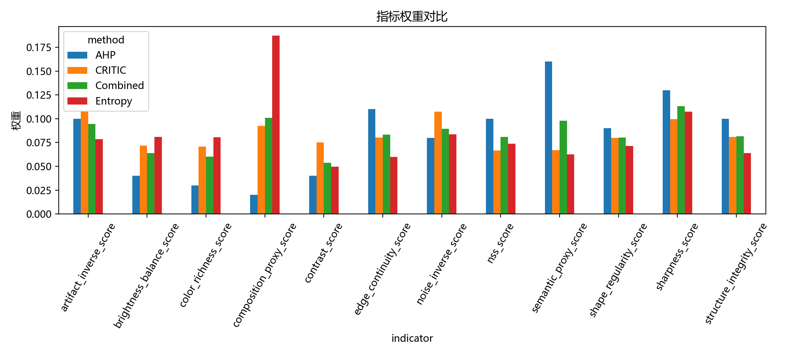

# M2 AHP-熵权-CRITIC 组合赋权模型

## AHP 一致性

- 最大特征值：12.000000
- CI：-0.000000
- CR：-0.000000
- 结论：PASS

## 组合权重

组合权重采用

$$
w=\alpha w^{AHP}+\beta w^{Entropy}+\gamma w^{CRITIC},\quad
\alpha+\beta+\gamma=1.
$$

网格搜索得到 $\alpha=0.35$，$\beta=0.36$，$\gamma=0.29$。

| indicator                 |    weight | method   |
|:--------------------------|----------:|:---------|
| semantic_proxy_score      | 0.0979559 | Combined |
| sharpness_score           | 0.113095  | Combined |
| nss_score                 | 0.080863  | Combined |
| noise_inverse_score       | 0.0894134 | Combined |
| artifact_inverse_score    | 0.0945705 | Combined |
| edge_continuity_score     | 0.0834056 | Combined |
| shape_regularity_score    | 0.0803655 | Combined |
| structure_integrity_score | 0.0815329 | Combined |
| brightness_balance_score  | 0.0639757 | Combined |
| contrast_score            | 0.0537171 | Combined |
| color_richness_score      | 0.0600707 | Combined |
| composition_proxy_score   | 0.101035  | Combined |

